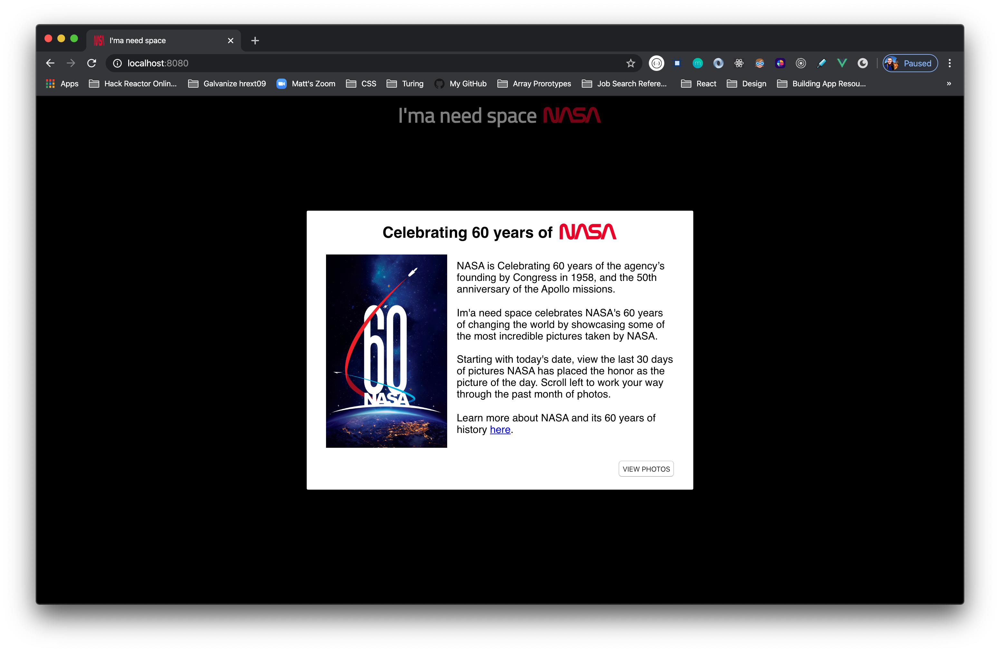

# I'ma need some space

By:
[Matthew Malone](https://github.com/matthewdshepherd)

## Table of Contents
* [Try It Out](#Try-It-Out)
* [Built With](#Built-With) 
* [Screenshots](#Screenshots)
* [Features](#Features)
* [Why'd-I-Do-This?](Why'd-I-Do-This?)

## Try It Out

Chekck it out here: [here](https://github.com/matthewdshepherd/imaneedsomespace)

## Built With

- HTML5
- CSS3
- JavaScript
- Vue
- OOP
- NASA API - picture of the day

## Screenshots

## Features

- [x] Built on Vue
- [x] Vue Modal
- [x] Fetch
- [x] NASA Photo of the Day API

## Why'd I Do This?

I am a student at Turing School of Software and Design, whom provioded the project specifications and website design. We are learning all the things on our way to becoming Software Engineers.
